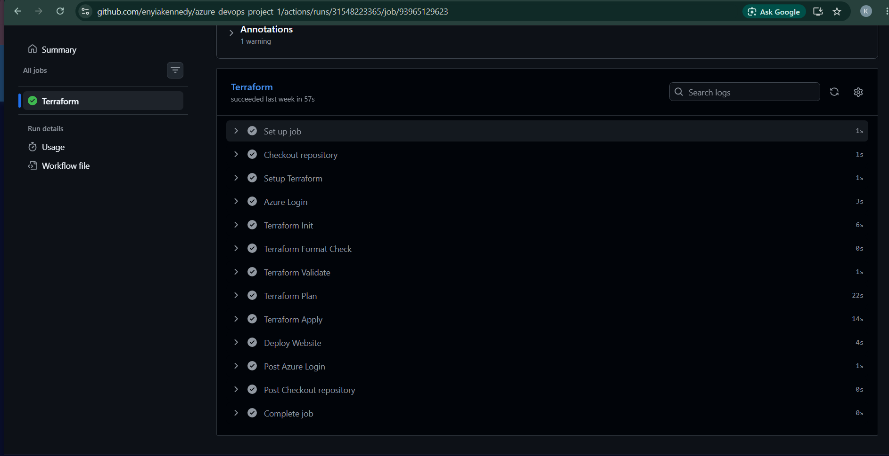
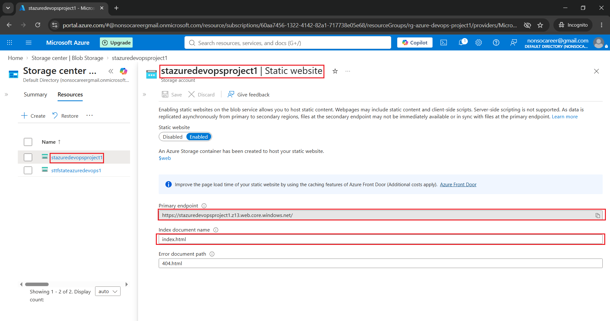
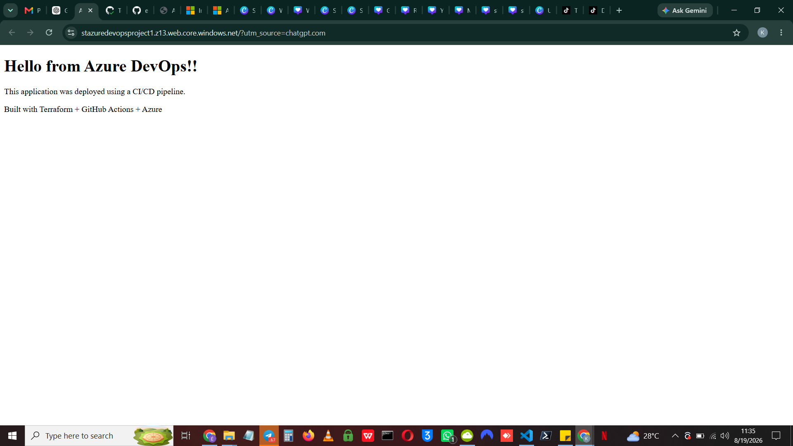

# Azure Static Website Deployment on Microsoft Azure using Terraform & GitHub Actions


## 📑 Table of Contents

- [Project Overview](#-project-overview)
- [Features](#-features)
- [Technologies Used](#️-technologies-used)
- [Architecture](#-architecture)
- [CI/CD Workflow](#-cicd-workflow)
- [Security](#-security)
- [Repository Structure](#-repository-structure)
- [Live Demo](#-live-demo)
- [Lessons Learned](#-lessons-learned)
- [Future Improvements](#-future-improvements)
- [Screenshots](#-screenshots)
- [Author](#-author)


## 📖 Project Overview

This project demonstrates how to provision Azure infrastructure using Terraform and automate the deployment of a static website using GitHub Actions.

The solution uses Infrastructure as Code (IaC), remote Terraform state stored in Azure Blob Storage, and passwordless authentication with Microsoft Entra ID Workload Identity Federation (OIDC) to securely deploy changes whenever code is pushed to the `main` branch.

## ✨ Features

- Provisioned Azure infrastructure using **Terraform**
- Hosted a static website using **Azure Storage Static Website**
- Stored Terraform state remotely in **Azure Blob Storage**
- Automated infrastructure validation and deployment with **GitHub Actions**
- Implemented **passwordless authentication** using Microsoft Entra ID Workload Identity Federation (OIDC)
- Applied **Azure RBAC** with least-privilege permissions
- Automatically deployed website updates after every push to the `main` branch
- Managed infrastructure using **Infrastructure as Code (IaC)**

## 🛠️ Technologies Used

| Category | Technologies |
|----------|--------------|
| Cloud Platform | Microsoft Azure |
| Infrastructure as Code | Terraform |
| CI/CD | GitHub Actions |
| Identity & Security | Microsoft Entra ID (OIDC), Azure RBAC |
| Storage | Azure Storage Account, Azure Blob Storage, Static Website |
| Version Control | Git, GitHub |
| Automation | Azure CLI |

## 🏗️ Architecture

The solution follows a simple but production-inspired CI/CD workflow.

Terraform provisions and manages the Azure infrastructure, while GitHub Actions automates validation, planning, deployment, and website updates.

Authentication between GitHub and Azure is performed using Microsoft Entra ID Workload Identity Federation (OIDC), eliminating the need to store long-lived secrets.

The static website is hosted in an Azure Storage Account, and Terraform state is securely stored in a separate Azure Storage Account using the Azure backend.


### Architecture Diagram

> *Architecture diagram coming soon.*

## 🔄 CI/CD Workflow

The project uses GitHub Actions to automate infrastructure validation, deployment, and website updates.

### Pull Request Workflow

When a Pull Request is opened against the `main` branch, GitHub Actions automatically:

1. Checks out the repository
2. Sets up Terraform
3. Initializes Terraform
4. Checks Terraform formatting
5. Validates the Terraform configuration
6. Generates a Terraform execution plan

This allows infrastructure changes to be reviewed before they are merged.

### Main Branch Deployment

When changes are merged into the `main` branch, GitHub Actions automatically:

1. Authenticates to Azure using Microsoft Entra ID Workload Identity Federation (OIDC)
2. Initializes Terraform
3. Validates the Terraform configuration
4. Creates a Terraform execution plan
5. Applies infrastructure changes
6. Uploads the latest website files to the Azure Storage Static Website

This provides an automated and repeatable deployment process without storing Azure credentials in GitHub.

## 🔐 Security

Security was a key consideration throughout this project.

### Passwordless Authentication

GitHub Actions authenticates to Azure using **Microsoft Entra ID Workload Identity Federation (OIDC)** instead of storing client secrets or passwords. This approach reduces the risk associated with long-lived credentials and follows modern cloud security best practices.

### Role-Based Access Control (RBAC)

The GitHub Actions identity was assigned only the Azure roles required to provision infrastructure and deploy website content, following the **principle of least privilege**.

### Remote Terraform State

Terraform state is stored remotely in a dedicated Azure Storage Account and Blob Container. Using a remote backend provides:

- Centralized state management
- State locking to prevent concurrent modifications
- Improved collaboration for team environments
- Better reliability compared to local state files

## 📂 Repository Structure

```text
azure-devops-project-1/
├── .github/
│   └── workflows/
│       └── terraform.yml          # GitHub Actions CI/CD workflow
├── infrastructure/
│   ├── backend.tf                 # Remote backend configuration
│   ├── main.tf                    # Azure resources
│   ├── outputs.tf                 # Terraform outputs
│   ├── provider.tf                # Provider configuration
│   ├── variables.tf               # Input variable
|                                     # Variable values (excluded from Git if sensitive)
├── index.html                     # Static website
├── .gitignore
└── README.md
```

## 🌐 Live Demo

**Azure Static Website**

https://stazuredevopsproject1.z13.web.core.windows.net/

> The website is automatically updated through the GitHub Actions CI/CD pipeline whenever changes are merged into the `main` branch.


## 📚 Lessons Learned

Building this project gave me hands-on experience with several core Azure DevOps concepts.

Some of the key lessons I learned include:

- Provisioning Azure infrastructure using Terraform
- Migrating Terraform state from a local backend to Azure Blob Storage
- Using Terraform data sources to reference existing Azure resources
- Implementing GitHub Actions to automate validation and deployment
- Configuring Microsoft Entra ID Workload Identity Federation (OIDC) for passwordless authentication
- Assigning Azure RBAC roles to enable secure infrastructure provisioning and storage operations
- Understanding the difference between Azure management-plane and data-plane permissions
- Troubleshooting CI/CD pipeline failures by analyzing GitHub Actions logs and Azure error messages
- Managing infrastructure changes safely using `terraform plan` before applying updates

## 🔮 Future Improvements

Possible enhancements for this project include:

- Organize the Terraform configuration into reusable modules
- Support multiple environments (Development, Test, and Production)
- Integrate Azure Key Vault for secret management
- Add automated security and compliance scanning
- Configure monitoring and alerts using Azure Monitor
- Add automated testing to the deployment pipeline
- Expand the static website into a containerized application deployed with Docker


## 📸 Screenshots

### GitHub Actions Pipeline



---

### Azure Static Website



---

### Live Website

